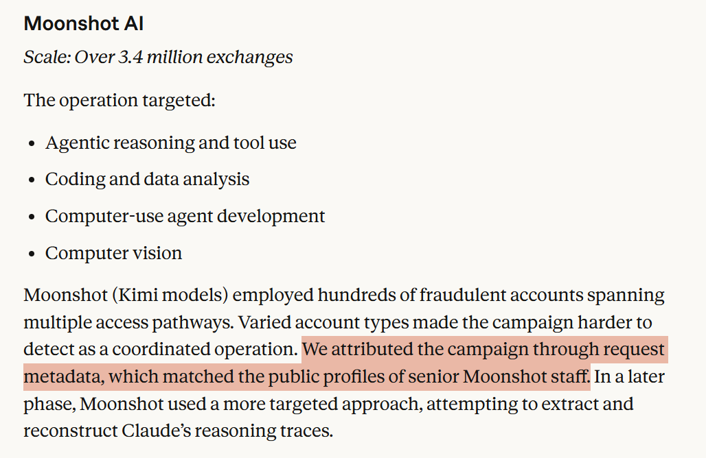

The public source corresponding to this image is Anthropic’s [`Detecting and preventing distillation attacks`](../../../references/01-detecting-and-preventing-distillation-attacks.md). The document explicitly states that Anthropic conducts attribution and identification through request metadata, IP address correlation, infrastructure indicators, and supplementary observations from industry partners. On the question of whether a platform may be able to identify specific users or organizational behavior through metadata and correlated signals, this material is itself worth preserving as a standalone reference point.
